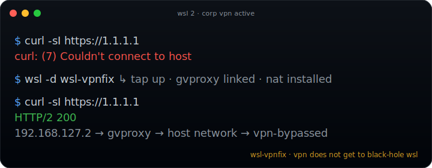

<!-- written by Robert Bopko (github.com/zeroznet) with Boba Bott (Claude Opus 4.7) -->

<p align="center">
  
</p>

<h1 align="center">wsl-vpnfix</h1>

<p align="center">
  <strong>route WSL 2 traffic through the Windows host so a corporate VPN does not black-hole it.</strong>
</p>

<p align="center">
  <a href="https://github.com/zeroznet/wsl-vpnfix/stargazers"></a>
  <a href="https://github.com/zeroznet/wsl-vpnfix/commits/main"></a>
  <a href="https://github.com/zeroznet/wsl-vpnfix/releases/latest"></a>
  <a href="LICENSE"></a>
  
  
  
</p>

<p align="center">
  <a href="#the-problem">Problem</a> ·
  <a href="#how-it-works">Flow</a> ·
  <a href="#install">Install</a> ·
  <a href="#usage">Usage</a> ·
  <a href="#updating">Updating</a> ·
  <a href="#uninstall">Uninstall</a> ·
  <a href="#what-it-isnt">Anti-features</a> ·
  <a href="#credits">Credits</a>
</p>

---

A single static Go binary, packaged as a small Alpine WSL 2 distro, that does one thing: when your corporate VPN client breaks WSL 2 connectivity, it puts your WSL traffic back on the network by tunneling it through the Windows host's network stack via [gvisor-tap-vsock](https://github.com/containers/gvisor-tap-vsock).

No Windows-side admin rights. No registry edits. No VPN client config. No Hyper-V switch surgery. You import a `tar.gz` as a WSL distro, start it, and your other distros work again.

A from-scratch rebuild of the dormant [`sakai135/wsl-vpnkit`](https://github.com/sakai135/wsl-vpnkit) (last release 2023-04-04). Same problem, repackaged: shell script replaced by a static Go orchestrator, three base images collapsed to one (Alpine), every input validated, every external binary pinned by SHA-256.

## The problem

WSL 2 runs in a lightweight VM with its own virtual network. Many corporate VPN clients (Cisco AnyConnect, GlobalProtect, Zscaler, Pulse, FortiClient, etc.) install routes or filters on the Windows side that the WSL VM's NIC cannot reach. When the VPN connects, your Linux distros lose DNS, lose internet, lose package managers, lose `git push`. When the VPN disconnects, everything works again.

The Microsoft-supported workarounds (mirrored mode, DNS tunneling) only cover some clients on some Windows builds, and they require Windows-side admin to flip on. wsl-vpnfix sidesteps the OS networking question entirely: WSL traffic never tries to leave the WSL VM as IP packets — it gets handed to a user-mode network stack that runs on the Windows host, which then issues outbound connections from the host's network identity. The VPN sees normal host traffic and doesn't filter it.

## How it works

```
 Windows host                              │  WSL 2 VM
                                           │
 ┌─────────────────────────────────────┐   │   ┌──────────────────────────────┐
 │  wsl-gvproxy.exe                    │   │   │  wsl-vpnfix distro           │
 │  (gvisor-tap-vsock, user-mode       │   │   │   /sbin/wsl-vpnfix (orch)    │
 │   TCP/IP stack, talks to host       │   │   │     ├─ wsltap 192.168.127.2  │
 │   network as a normal app)          │   │   │     ├─ default via .127.1    │
 │                                     │◄──┼──►│     └─ nft NAT: redirect DNS │
 │  staged at:                         │ stdio │        + masquerade out      │
 │  C:\Users\Public\.wsl-vpnfix\…      │   │   │                              │
 └─────────────────────────────────────┘   │   │   ┌──────────────────────┐   │
                                           │   │   │  sibling distro       │  │
                                           │   │   │  (Ubuntu, Debian, …) │   │
                                           │   │   │  inherits the route  │   │
                                           │   │   └──────────────────────┘   │
                                           │   └──────────────────────────────┘
```

1. You import `wsl-vpnfix-X.Y.Z.tar.gz` as a WSL 2 distro called `wsl-vpnfix`.
2. On distro boot, `wsl.conf [boot] command=` starts `/sbin/wsl-vpnfix` as a child of WSL's `/init`.
3. The orchestrator stages `wsl-gvproxy.exe` to a Windows NTFS path, validates the SHA-256, and spawns it via WSL interop.
4. `wsl-gvforwarder` opens a tap device (`wsltap`) inside the WSL VM, exchanges packets with the .exe over stdio.
5. nftables rewrites: WSL2 host gateway `→` host IP, DNS `→` gvproxy gateway, masquerade out the tap.
6. Other WSL distros use the same WSL 2 VM kernel and inherit the route. Their traffic goes out through the .exe, which runs as a normal Windows process, which the VPN does not filter.

The runtime is one static Go binary (`/sbin/wsl-vpnfix`) that talks to the kernel via netlink (no shelling out to `iptables`, `nft`, or `ip`), and one Windows .exe shipped alongside it. No daemon installer, no Windows service, no persistent Windows-side process — the optional auto-start at logon is a one-shot Task Scheduler entry that kicks the distro and exits in under a second.

## Install

You need a Windows 10 22H2+ or Windows 11 host with WSL 2 installed (`wsl --install` if you don't have it yet). No admin rights are needed for the wsl-vpnfix install itself.

### Quick install (recommended)

Open **PowerShell** (regular, not admin) and run:

```powershell
iwr -UseBasicParsing https://raw.githubusercontent.com/zeroznet/wsl-vpnfix/main/scripts/install-wslvpnfix.ps1 | iex
```

This pulls the latest release tarball from GitHub Releases, verifies it against `SHA256SUMS`, imports it as the `wsl-vpnfix` distro under `%LOCALAPPDATA%\wsl-vpnfix\`, starts the appliance silently in the background (no visible console window), and registers a per-user Task Scheduler entry named `wsl-vpnfix` that re-launches it at every logon. Native Windows mechanism, no scripts in `shell:startup`, auditable from `taskschd.msc`. After the script returns, your other WSL distros already have working network connectivity through it.

Override the defaults with parameters:

```powershell
$script = (iwr -UseBasicParsing https://raw.githubusercontent.com/zeroznet/wsl-vpnfix/main/scripts/install-wslvpnfix.ps1).Content
$sb = [scriptblock]::Create($script)
& $sb -Tag v0.1.0 -DistroName wsl-vpnfix -InstallDir "$env:LOCALAPPDATA\wsl-vpnfix"
```

| Parameter | Default | Purpose |
|---|---|---|
| `-Tag` | `latest` | which release to install (`latest` or `vN.N.N`) |
| `-DistroName` | `wsl-vpnfix` | name to register under `wsl --list` |
| `-InstallDir` | `$env:LOCALAPPDATA\wsl-vpnfix` | where the rootfs `ext4.vhdx` lives |
| `-Force` | off | unregister an existing distro of the same name without prompting |
| `-NoAutoStart` | off | skip the silent auto-start launcher; you control startup manually |

### Manual install

If you'd rather not pipe a script from the internet — sensible — grab the artifacts and import them by hand:

1. Go to the [latest release](https://github.com/zeroznet/wsl-vpnfix/releases/latest).
2. Download `wsl-vpnfix-X.Y.Z.tar.gz` and `SHA256SUMS`.
3. Verify the tarball:

   ```powershell
   Get-FileHash wsl-vpnfix-0.1.0.tar.gz -Algorithm SHA256
   # Compare against the line for that filename in SHA256SUMS.
   ```

4. Import it:

   ```powershell
   $dst = "$env:LOCALAPPDATA\wsl-vpnfix"
   New-Item -ItemType Directory -Force -Path $dst | Out-Null
   wsl --import wsl-vpnfix $dst .\wsl-vpnfix-0.1.0.tar.gz --version 2
   ```

### Build from source

The release artifact is reproducible — building from the same git commit + `build/upstream-pins.yaml` produces a bit-identical tarball. Verify or rebuild yourself:

```sh
git clone https://github.com/zeroznet/wsl-vpnfix && cd wsl-vpnfix
./build/pack.sh 0.1.0
sha256sum out/wsl-vpnfix-0.1.0.tar.gz
```

The build runs inside a digest-pinned Alpine container via `podman` (or `docker`, if `podman` is missing). Toolchain is fully self-contained — no Go install on the host.

## Usage

The installer leaves the appliance running, configured to auto-start at every logon. There is nothing to type after install. Your other WSL distros (Ubuntu, Debian, etc.) inherit working network connectivity through it — including while the corporate VPN is connected.

Optional — verify it's up:

```powershell
wsl -l -v                                    # wsl-vpnfix should show 'Running'
wsl -d Ubuntu -- curl -sI https://1.1.1.1   # expect HTTP/2 200
```

Manual control, if you ever need it:

| Action | Command |
|---|---|
| Restart the appliance | `wsl --terminate wsl-vpnfix; Start-ScheduledTask -TaskName wsl-vpnfix` |
| Stop the appliance | `wsl --terminate wsl-vpnfix` |
| Audit the auto-start entry | `Get-ScheduledTask -TaskName wsl-vpnfix \| Select-Object -Property *` (or `taskschd.msc`) |
| Disable auto-start at logon | `Disable-ScheduledTask -TaskName wsl-vpnfix` |
| Re-enable auto-start at logon | `Enable-ScheduledTask -TaskName wsl-vpnfix` |
| Remove auto-start entirely | `Unregister-ScheduledTask -TaskName wsl-vpnfix -Confirm:$false` |
| Inspect the orchestrator interactively | `wsl -d wsl-vpnfix` (drops you into a root shell; the orchestrator stdout is captured per session) |

The auto-start mechanism is a single per-user Task Scheduler entry. No service, no admin rights, no scripts in `shell:startup`. The task action is a plain hidden `powershell.exe` that calls `wsl.exe -d wsl-vpnfix --exec /bin/true` and exits — the orchestrator stays alive as a child of WSL's `/init`.

## Updating

```powershell
iwr -UseBasicParsing https://raw.githubusercontent.com/zeroznet/wsl-vpnfix/main/scripts/install-wslvpnfix.ps1 | iex
```

The installer detects an existing `wsl-vpnfix` distro, prompts before overwriting, and replays the import against the new tarball. Sibling distros are not touched.

## Uninstall

```powershell
Unregister-ScheduledTask -TaskName wsl-vpnfix -Confirm:$false
wsl --terminate wsl-vpnfix
wsl --unregister wsl-vpnfix
Remove-Item -Recurse "$env:LOCALAPPDATA\wsl-vpnfix"
```

Four lines, in order: drop the auto-start task, terminate the distro, drop the WSL registration, drop the rootfs. No Windows service, no registry hive, no leftover `%PROGRAMDATA%`. The `C:\Users\Public\.wsl-vpnfix\` staging directory holds the .exe and is removed by the orchestrator on graceful shutdown; if a crash leaves it behind, delete it by hand.

## What it isn't

This is deliberately a small tool. It does not, and will not:

- act as a VPN client itself, or replace one
- decrypt, intercept, or proxy VPN traffic
- need or request Windows admin rights
- modify Windows-side routing, firewall, or DNS resolver
- run a Windows service, persistent background agent, or anything that consumes Windows resources past the one-second logon kick
- ship Ubuntu or Fedora variants — Alpine is the only base
- ship anything but a single static Go binary as the runtime
- shell out to `iptables`, `nft`, `ip`, `wsl.exe`, or `cmd.exe`
- include a GUI, a settings panel, or an autoconfig helper
- collect telemetry, phone home, or log to a remote sink

If you need any of the above, you need a different tool.

## Files

- `cmd/wsl-vpnfix/` — orchestrator entrypoint
- `internal/{config,netlink,netfilter,process,wsl,healthcheck}/` — runtime modules
- `build/Dockerfile.rootfs` — three-stage rootfs build (Go builder, upstream fetcher, final Alpine assembly)
- `build/pack.sh` — deterministic tarball producer
- `build/upstream-pins.yaml` — pinned `gvisor-tap-vsock` release + SHA-256s
- `scripts/install-wslvpnfix.ps1` — Windows-side installer
- `dev/` — dev container (Alpine + Go) and run wrapper
- `docs/superpowers/{specs,plans}/` — design contract and frozen phase plans

## Credits

The networking backend is [containers/gvisor-tap-vsock](https://github.com/containers/gvisor-tap-vsock) — the `gvproxy.exe` and `gvforwarder` binaries are pulled verbatim from upstream releases and verified by SHA-256 before bundling. Idea and reference architecture: [sakai135/wsl-vpnkit](https://github.com/sakai135/wsl-vpnkit).

## License

BSD-2-Clause. See [LICENSE](LICENSE).
